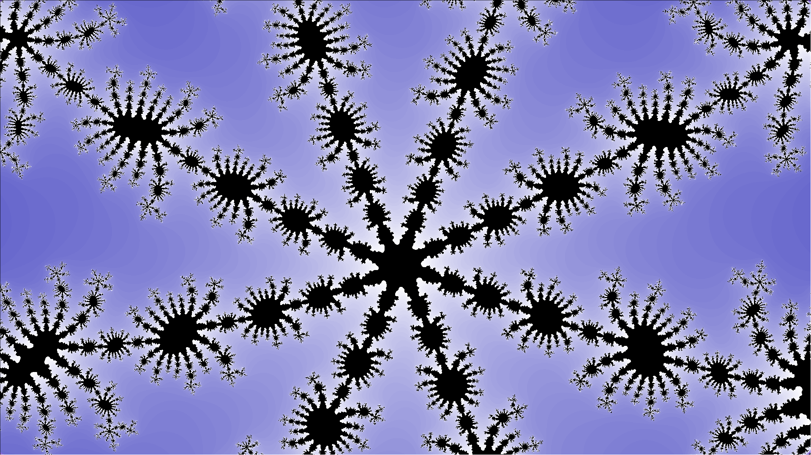

# Fractal Viewer

## Example Images

## Description

This project is a simple viewer of the Mandelbrot and Julia sets

## Functionality

- Use mouse wheel to zoom in/out
- Use Ctrl or Shift and zoom to change initial parameters
